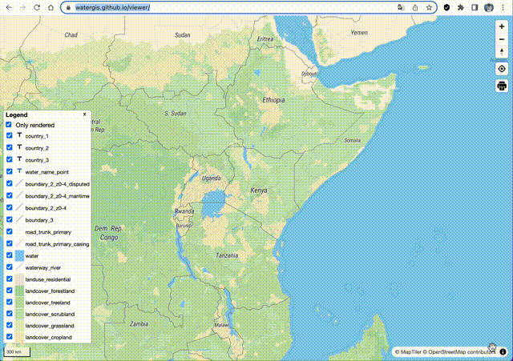

# viewer

Everything you need to build a Svelte project, powered by [`create-svelte`](https://github.com/sveltejs/kit/tree/master/packages/create-svelte).

This is a simple viewer to visualise third party Maplibre Style JSON.



## How to use it

```zsh
https://watergis.github.io/viewer?style={Your StyleJSON URL}
```

For example,

open [https://watergis.github.io/viewer?style=https://narwassco.github.io/mapbox-stylefiles/unvt/style.json](https://watergis.github.io/viewer?style=https://narwassco.github.io/mapbox-stylefiles/unvt/style.json).

## Creating a project

If you're seeing this, you've probably already done this step. Congrats!

```bash
# create a new project in the current directory
npm init svelte

# create a new project in my-app
npm init svelte my-app
```

## Environmental variables

```bash
cp .env.example
vi .env
```

Add your own API key `VITE_MAPTILER_KEY` for maptiler. The key can be created at maptiler website [here](https://cloud.maptiler.com/account/keys/). You probably need to sign up first.

## Developing

Once you've created a project and installed dependencies with `npm install` (or `pnpm install` or `yarn`), start a development server:

```bash
npm run dev

# or start the server and open the app in a new browser tab
npm run dev -- --open
```

open [http://localhost:3000/sveltekit-maplibre-boilerplate](http://localhost:3000/sveltekit-maplibre-boilerplate).

The path of URL can be changed at [svelte.config.js](./svelte.config.js).

## Building

To create a production version of your app:

```bash
npm run build
```

You can preview the production build with `npm run preview`.

> To deploy your app, you may need to install an [adapter](https://kit.svelte.dev/docs/adapters) for your target environment.
